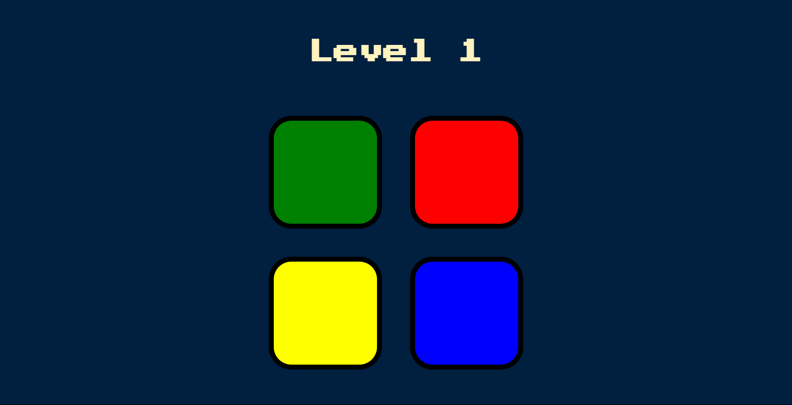

# Simon Game



## Description

The Simon Game is a classic electronic memory game that tests your memory and sequencing skills. The game consists of four colored buttons that light up and produce a sound in a specific order. Your task is to remember the sequence and repeat it by clicking the buttons in the correct order. The game becomes progressively harder as you successfully complete each level by adding one more step to the sequence.

This implementation of the Simon Game is built using HTML, CSS, and JavaScript, with the jQuery library to handle user interactions and game logic.

## Features

- Simple and intuitive interface.
- Engaging gameplay to test and improve your memory.
- Progressive difficulty with each level.
- Auditory and visual cues to aid in memorization.
- High score tracking.

## Demo

You can play the Simon Game online by visiting the following link: [Simon Game Demo](https://anton-ovod.github.io/Simon-Game/)

## Installation

To run the Simon Game locally on your machine, follow these steps:

1. Clone this repository to your local machine using the following command:

   ```bash
   https://github.com/anton-ovod/Simon-Game.git
   ```

2. Open the `index.html` file in your web browser.

## Usage

- Press any key to begin the game.
- Pay attention to the sequence of button flashes and sounds.
- Repeat the sequence by clicking the buttons in the correct order.
- If you make a mistake, the game will display your score and allow you to start over.
- Successfully complete a level to progress to the next, where the sequence becomes longer and more challenging.

## Contributing

Contributions are welcome! If you have any bug fixes, improvements, or new features to propose, please open an issue or submit a pull request.

## License

This project is licensed under the MIT License - see the [LICENSE](LICENSE) file for details.

## Acknowledgments

- This project was inspired by the classic Simon Game toy.

Happy gaming!
